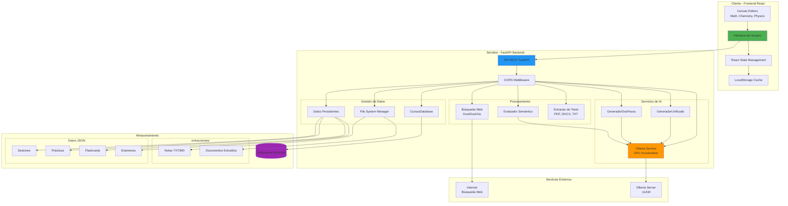
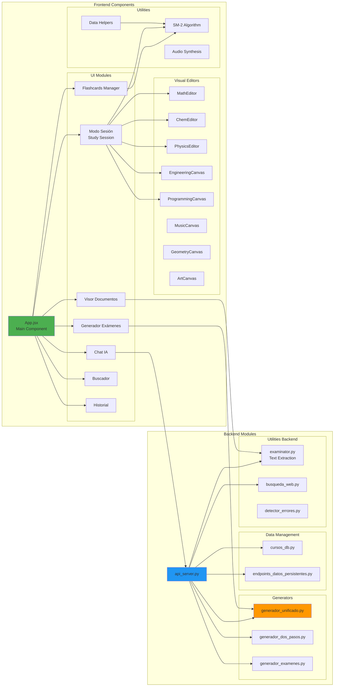
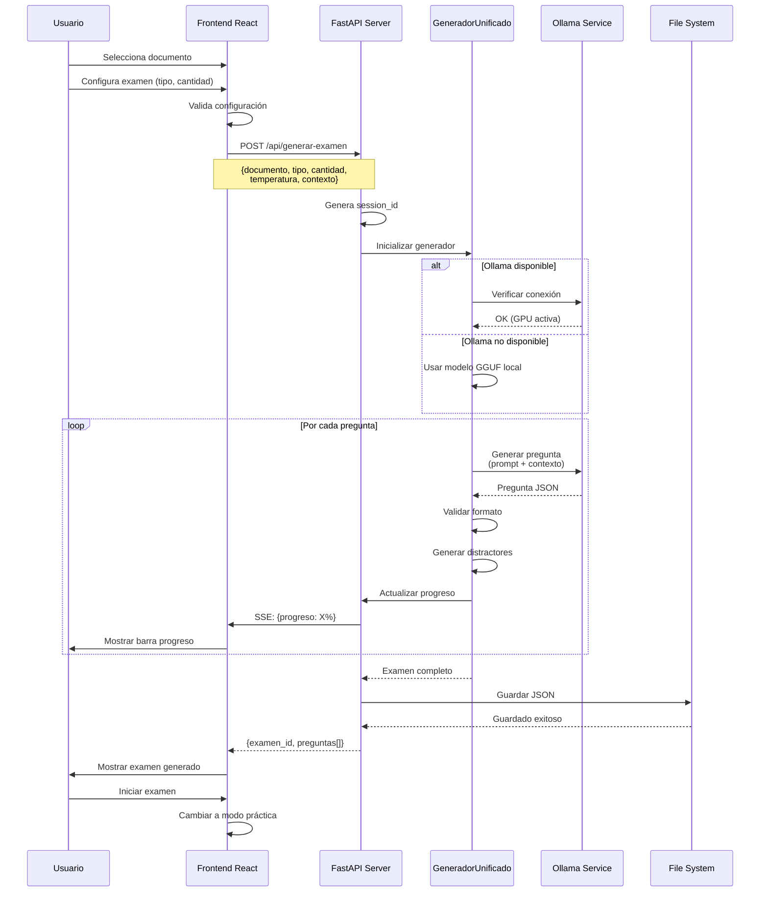
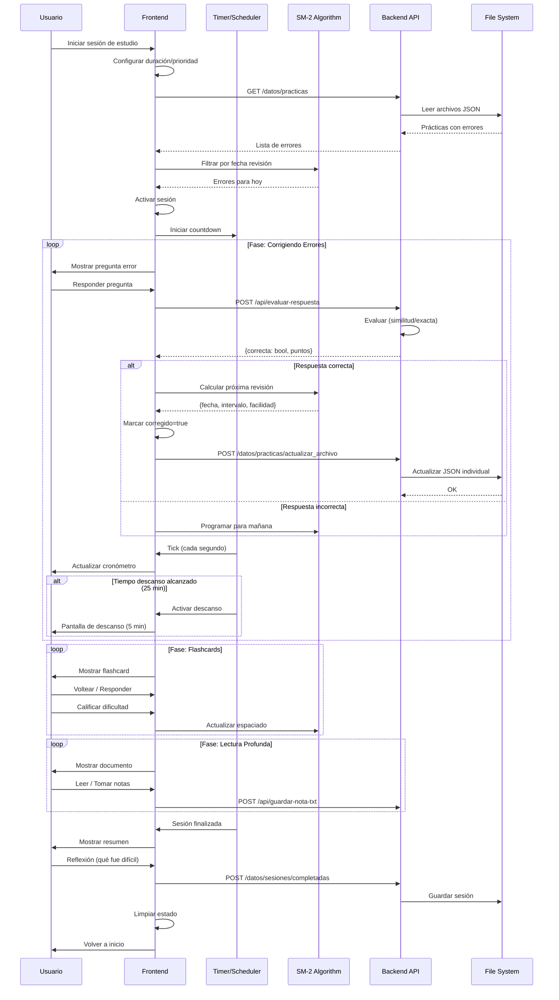
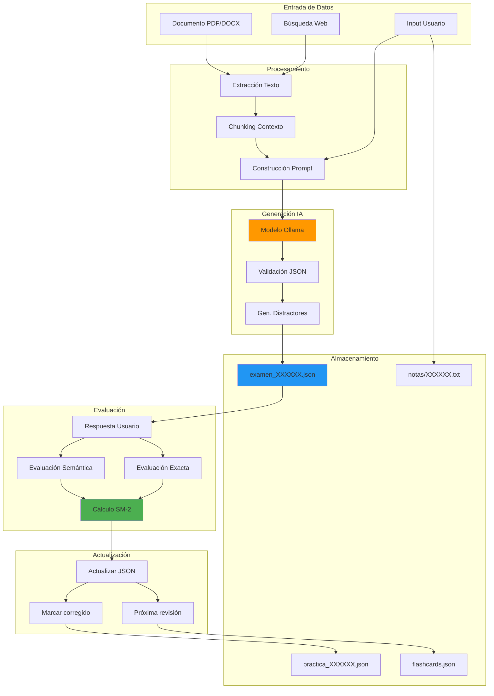
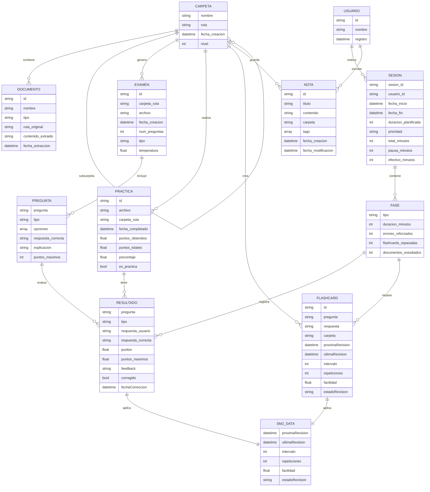
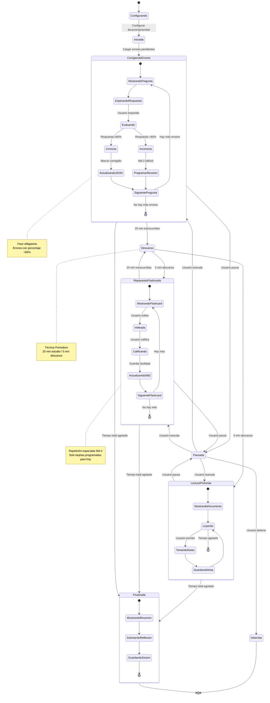
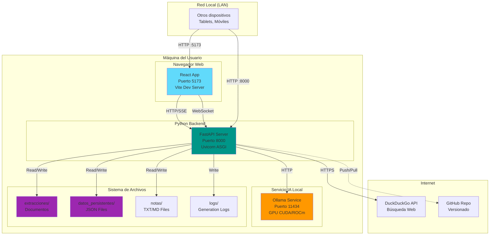

# 📐 Diagramas de Ingeniería - Sistema Examinator

> **Sistema de estudio inteligente con generación de exámenes, flashcards, corrección automática y repetición espaciada impulsado por IA**

---

## 📑 Índice de Diagramas

1. [Diagrama de Arquitectura del Sistema](#1-diagrama-de-arquitectura-del-sistema)
2. [Diagrama de Componentes](#2-diagrama-de-componentes)
3. [Diagrama de Secuencia - Generación de Examen](#3-diagrama-de-secuencia---generación-de-examen)
4. [Diagrama de Secuencia - Sesión de Estudio](#4-diagrama-de-secuencia---sesión-de-estudio)
5. [Diagrama de Flujo de Datos](#5-diagrama-de-flujo-de-datos)
6. [Diagrama Entidad-Relación](#6-diagrama-entidad-relación)
7. [Diagrama de Estados - Sesión de Estudio](#7-diagrama-de-estados---sesión-de-estudio)
8. [Diagrama de Casos de Uso](#8-diagrama-de-casos-de-uso)
9. [Diagrama de Despliegue](#9-diagrama-de-despliegue)
10. [Diagrama de Clases Backend](#10-diagrama-de-clases-backend)

---

## 1. Diagrama de Arquitectura del Sistema



---

## 2. Diagrama de Componentes



---

## 3. Diagrama de Secuencia - Generación de Examen



---

## 4. Diagrama de Secuencia - Sesión de Estudio



---

## 5. Diagrama de Flujo de Datos



---

## 6. Diagrama Entidad-Relación



---

## 7. Diagrama de Estados - Sesión de Estudio



---

## 8. Diagrama de Casos de Uso

```mermaid
graph TB
    subgraph "Sistema Examinator"
        subgraph "Gestión Documentos"
            UC1[Subir documento PDF/DOCX]
            UC2[Organizar en carpetas]
            UC3[Buscar documento]
            UC4[Ver contenido extraído]
        end
        
        subgraph "Generación de Contenido"
            UC5[Generar examen]
            UC6[Configurar tipo preguntas]
            UC7[Ajustar dificultad]
            UC8[Crear flashcards automáticas]
        end
        
        subgraph "Práctica y Evaluación"
            UC9[Realizar práctica]
            UC10[Responder preguntas]
            UC11[Ver feedback IA]
            UC12[Revisar errores]
        end
        
        subgraph "Sesión de Estudio"
            UC13[Iniciar sesión]
            UC14[Corregir errores clave]
            UC15[Repasar flashcards]
            UC16[Lectura profunda]
            UC17[Tomar notas]
            UC18[Pausar/Reanudar]
            UC19[Finalizar sesión]
        end
        
        subgraph "Repetición Espaciada"
            UC20[Ver calendario revisiones]
            UC21[Revisar items programados]
            UC22[Actualizar espaciado SM-2]
        end
        
        subgraph "Chat IA"
            UC23[Hacer pregunta a IA]
            UC24[Buscar en web]
            UC25[Explicar concepto]
        end
        
        subgraph "Historial"
            UC26[Ver sesiones completadas]
            UC27[Ver estadísticas]
            UC28[Exportar datos]
        end
        
        subgraph "Configuración"
            UC29[Seleccionar modelo IA]
            UC30[Ajustar temperatura]
            UC31[Configurar GPU]
        end
    end
    
    ESTUDIANTE((Estudiante))
    ADMIN((Administrador))
    OLLAMA_SRV[Ollama Server]
    WEB_SRV[Servicio Web]
    
    ESTUDIANTE --> UC1
    ESTUDIANTE --> UC2
    ESTUDIANTE --> UC3
    ESTUDIANTE --> UC4
    ESTUDIANTE --> UC5
    ESTUDIANTE --> UC6
    ESTUDIANTE --> UC7
    ESTUDIANTE --> UC8
    ESTUDIANTE --> UC9
    ESTUDIANTE --> UC10
    ESTUDIANTE --> UC11
    ESTUDIANTE --> UC12
    ESTUDIANTE --> UC13
    ESTUDIANTE --> UC14
    ESTUDIANTE --> UC15
    ESTUDIANTE --> UC16
    ESTUDIANTE --> UC17
    ESTUDIANTE --> UC18
    ESTUDIANTE --> UC19
    ESTUDIANTE --> UC20
    ESTUDIANTE --> UC21
    ESTUDIANTE --> UC22
    ESTUDIANTE --> UC23
    ESTUDIANTE --> UC24
    ESTUDIANTE --> UC25
    ESTUDIANTE --> UC26
    ESTUDIANTE --> UC27
    ESTUDIANTE --> UC28
    
    ADMIN --> UC29
    ADMIN --> UC30
    ADMIN --> UC31
    
    UC5 --> OLLAMA_SRV
    UC8 --> OLLAMA_SRV
    UC11 --> OLLAMA_SRV
    UC23 --> OLLAMA_SRV
    UC25 --> OLLAMA_SRV
    
    UC24 --> WEB_SRV
    
    style ESTUDIANTE fill:#4CAF50
    style ADMIN fill:#FF9800
    style OLLAMA_SRV fill:#2196F3
```



---

## 9. Diagrama de Despliegue



**Puertos utilizados:**
- **5173**: Frontend React (Vite)
- **8000**: Backend FastAPI
- **11434**: Ollama Service

**Protocolos:**
- HTTP REST para API calls
- Server-Sent Events (SSE) para progreso en tiempo real
- WebSocket para chat en tiempo real

---

## 10. Diagrama de Clases Backend

```mermaid
classDiagram
    class FastAPIApp {
        +CORSMiddleware middleware
        +startup_event()
        +listar_modelos()
        +generar_examen()
        +evaluar_respuesta()
        +guardar_nota()
    }
    
    class GeneradorUnificado {
        -usar_ollama: bool
        -modelo_ollama: str
        -modelo_gguf: LlamaCpp
        -temperatura: float
        +generar_pregunta(contexto, tipo)
        +generar_flashcard(error)
        +validar_json(respuesta)
    }
    
    class GeneradorDosPasos {
        -llm: LlamaCpp
        -temperatura: float
        +generar_pregunta_paso1(texto)
        +refinar_paso2(pregunta)
        +generar_distractores(pregunta)
    }
    
    class CursosDatabase {
        -base_path: Path
        +crear_carpeta(nombre, ruta)
        +listar_carpetas(ruta)
        +mover_carpeta(origen, destino)
        +buscar_documentos(query)
    }
    
    class ExaminadorTexto {
        +obtener_texto(archivo)
        +extraer_pdf(ruta)
        +extraer_docx(ruta)
        +extraer_txt(ruta)
    }
    
    class DetectorErrores {
        -errores: List
        +analizar_examen(resultados)
        +identificar_patrones()
        +generar_reporte()
    }
    
    class BusquedaWeb {
        +buscar_duckduckgo(query)
        +resumir_resultados(resultados)
        +extraer_snippets()
    }
    
    class EvaluadorSemantico {
        -llm: LlamaCpp
        +calcular_similitud(texto1, texto2)
        +evaluar_respuesta(usuario, correcta)
        +generar_feedback(comparacion)
    }
    
    class SM2Algorithm {
        +calcular_facilidad(calidad)
        +calcular_intervalo(facilidad, repeticiones)
        +proxima_revision(fecha_actual, intervalo)
    }
    
    class PreguntaExamen {
        +pregunta: str
        +tipo: str
        +opciones: List[str]
        +respuesta_correcta: str
        +explicacion: str
        +puntos_maximos: int
    }
    
    class Examen {
        +id: str
        +carpeta_ruta: str
        +fecha_creacion: datetime
        +preguntas: List[PreguntaExamen]
        +tipo: str
    }
    
    class Practica {
        +id: str
        +archivo: str
        +carpeta_ruta: str
        +fecha_completado: datetime
        +puntos_obtenidos: float
        +puntos_totales: float
        +porcentaje: float
        +resultados: List[Resultado]
        +es_practica: bool
    }
    
    class Resultado {
        +pregunta: str
        +tipo: str
        +respuesta_usuario: str
        +respuesta_correcta: str
        +puntos: float
        +puntos_maximos: float
        +feedback: str
        +corregido: bool
        +fechaCorreccion: datetime
    }
    
    class Flashcard {
        +id: str
        +pregunta: str
        +respuesta: str
        +carpeta: str
        +proximaRevision: datetime
        +ultimaRevision: datetime
        +intervalo: int
        +repeticiones: int
        +facilidad: float
        +estadoRevision: str
    }
    
    class Sesion {
        +sesion_id: str
        +usuario_id: str
        +fecha_inicio: datetime
        +fecha_fin: datetime
        +duracion_planificada: int
        +total_minutos: int
        +errores_reforzados: int
        +flashcards_repasadas: int
    }
    
    FastAPIApp --> GeneradorUnificado
    FastAPIApp --> GeneradorDosPasos
    FastAPIApp --> CursosDatabase
    FastAPIApp --> ExaminadorTexto
    FastAPIApp --> DetectorErrores
    FastAPIApp --> BusquedaWeb
    FastAPIApp --> EvaluadorSemantico
    
    GeneradorUnificado --> PreguntaExamen
    GeneradorDosPasos --> PreguntaExamen
    
    Examen *-- PreguntaExamen
    Practica *-- Resultado
    
    EvaluadorSemantico --> Resultado
    SM2Algorithm --> Flashcard
    SM2Algorithm --> Resultado
    
    CursosDatabase --> Examen
    CursosDatabase --> Practica
    CursosDatabase --> Flashcard
    CursosDatabase --> Sesion
```



---

## 📊 Métricas del Sistema

### Performance
- **Tiempo generación examen (10 preguntas)**: ~2-5 minutos
- **Evaluación semántica**: ~500ms por pregunta
- **Carga inicial**: ~1-2 segundos
- **Uso GPU**: 70-90% durante generación

### Capacidad
- **Archivos concurrentes**: Ilimitados
- **Tamaño máximo PDF**: 50MB
- **Sesiones simultáneas**: 1 por usuario
- **Flashcards por carpeta**: Ilimitadas

### Almacenamiento
```
extracciones/
├── Carpeta1/
│   ├── documentos/           # PDFs extraídos
│   ├── resultados_examenes/  # Exámenes individuales
│   ├── resultados_practicas/ # Prácticas individuales
│   └── notas/               # Notas TXT/MD
└── datos_persistentes/
    ├── flashcards.json      # Todas las flashcards
    ├── sesiones.json        # Sesiones completadas
    └── sesion_activa.json   # Sesión en curso
```

---

## 🔐 Seguridad

- **CORS**: Configurado para red local (*)
- **Validación**: JSON Schema en todas las requests
- **Sanitización**: Escape de HTML en respuestas
- **Rate Limiting**: No implementado (uso local)
- **Autenticación**: No requerida (uso local)

---

## 🚀 Tecnologías Clave

### Frontend
- **React 19.2.0** - UI Framework
- **Vite 7.2.2** - Build tool
- **KaTeX 0.16.25** - Math rendering
- **Mermaid 11.12.1** - Diagramas
- **MathLive 0.108.2** - Editor matemático

### Backend
- **FastAPI** - Web framework
- **Uvicorn** - ASGI server
- **Ollama** - LLM inference
- **PyPDF2** - PDF extraction
- **python-docx** - DOCX extraction

### IA
- **Llama 3.1 8B** - Modelo principal
- **Qwen 2.5** - Modelo alternativo
- **DeepSeek R1** - Razonamiento
- **CUDA/ROCm** - Aceleración GPU

---

## 📝 Notas de Implementación

### Patrón de Arquitectura
- **Frontend**: Component-based (React)
- **Backend**: Microservicios (FastAPI)
- **Datos**: File-based JSON (sin BD tradicional)
- **IA**: Local inference (sin cloud)

### Decisiones de Diseño

1. **¿Por qué archivos JSON individuales?**
   - Evita conflictos de escritura
   - Fácil versionado con Git
   - Sin necesidad de ORM
   - Portable y legible

2. **¿Por qué Ollama local?**
   - Privacidad total (sin cloud)
   - Sin costos de API
   - Baja latencia
   - Control total del modelo

3. **¿Por qué SM-2 para repetición espaciada?**
   - Algoritmo probado (Anki lo usa)
   - Simple pero efectivo
   - Fácil de implementar
   - Adaptable

4. **¿Por qué FastAPI?**
   - Async nativo
   - Validación automática (Pydantic)
   - Documentación auto-generada
   - Alto rendimiento

---

## 🔄 Flujos Críticos

### 1. Flujo de Corrección de Errores
```
Error guardado (corregido=false)
    ↓
Extracción en sesión (porcentaje <60%)
    ↓
Mostrar al usuario
    ↓
Usuario responde
    ↓
Evaluación semántica
    ↓
Si correcta:
    - Marcar corregido=true
    - Calcular próxima revisión (SM-2)
    - Actualizar JSON individual
    - Recargar desde backend
    - Verificar que no está en lista
    ↓
Continuar con siguiente
```

### 2. Flujo de Guardado Distribuido
```
Usuario completa práctica
    ↓
Frontend detecta archivo individual
    (tiene carpeta_ruta + archivo)
    ↓
POST /datos/practicas/actualizar_archivo
    ↓
Backend busca:
    extracciones/{carpeta_ruta}/resultados_practicas/{archivo}.json
    ↓
Actualiza JSON con:
    - Nuevos resultados
    - Recalcula porcentaje
    - Actualiza fecha
    ↓
Guarda en mismo archivo
```

---

**Última actualización**: 26 de noviembre de 2025  
**Versión del sistema**: 3.0 (Corrección de errores v3)  
**Autor**: Sistema Examinator Team
