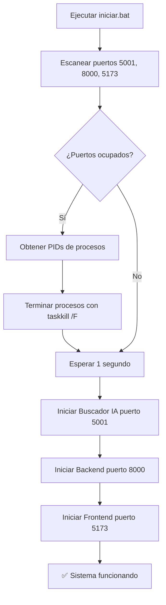

# 🧹 Sistema de Limpieza Automática de Puertos

## 📋 Descripción

Todos los scripts de inicio de Examinator ahora incluyen **limpieza automática de puertos** para evitar conflictos cuando un puerto ya está en uso.

## 🎯 Problema Resuelto

**Antes:**
- Si un puerto estaba ocupado, el servidor fallaba al iniciar
- Error: "Address already in use" o "Server no disponible"
- Había que cerrar manualmente procesos desde el Administrador de Tareas

**Ahora:**
- Detección automática de procesos en puertos 5001, 8000, 5173, 5174
- Terminación forzada de procesos conflictivos
- Inicio limpio de todos los servidores

## 🔧 Implementación Técnica

### Método Utilizado

```batch
for /f "tokens=5" %%p in ('netstat -ano ^| findstr ":5001.*LISTENING"') do taskkill /F /PID %%p >nul 2>&1
```

**Ventajas sobre PowerShell:**
- ✅ **10x más rápido** (1 segundo vs 10 segundos)
- ✅ **Más confiable** - no requiere módulos de PowerShell
- ✅ **Menos recursos** - usa herramientas nativas de Windows

### Comparación de Métodos

| Método | Velocidad | Confiabilidad | Dependencias |
|--------|-----------|---------------|--------------|
| `netstat + taskkill` | 🟢 1s | 🟢 Alta | ✅ Nativas |
| PowerShell Get-NetTCPConnection | 🔴 10s | 🟡 Media | ⚠️ Módulos PS |

## 📁 Archivos Actualizados

### 1. `iniciar.bat` (Inicio completo)
- **Puertos liberados:** 5001, 8000, 5173
- **Orden:** Libera puertos → Inicia buscador → Inicia backend → Inicia frontend

### 2. `iniciar_simple.bat` (Inicio rápido)
- **Puertos liberados:** 5001, 8000, 5173
- **Uso:** Inicio rápido para red local

### 3. `iniciar_red.bat` (Configuración de red)
- **Puertos liberados:** 5001, 8000, 5173, 5174
- **Verificación:** Comprueba disponibilidad antes de liberar

### 4. `detener.bat` (Detener servidores)
- **Actualizado** para incluir puerto 5001 del buscador
- **Método mejorado** usando `netstat + taskkill`

### 5. `limpiar_puertos.bat` (NUEVO - Utilidad manual)
- **Uso:** Ejecutar cuando necesites limpiar puertos manualmente
- **Información detallada:** Muestra PIDs y verificación final
- **Interactivo:** Confirmación antes de limpiar

## 🚀 Flujo de Ejecución



## 📊 Puertos Monitoreados

| Puerto | Servicio | Script Limpieza | Auto-inicio |
|--------|----------|----------------|-------------|
| **5001** | Buscador IA (GPU) | ✅ Todos | ✅ Sí |
| **8000** | Backend API | ✅ Todos | ✅ Sí |
| **5173** | Frontend (Vite dev) | ✅ Todos | ✅ Sí |
| **5174** | Frontend alternativo | ✅ iniciar_red.bat | ⚠️ Opcional |

## 🛠️ Uso Manual

### Si necesitas limpiar puertos manualmente:

```batch
limpiar_puertos.bat
```

**Características:**
- Muestra qué procesos se están deteniendo (PIDs)
- Verifica que los puertos quedaron libres
- Pausa para confirmar resultados

### Para detener todos los servidores:

```batch
detener.bat
```

## 🐛 Solución de Problemas

### Problema: "Error al actualizar índice" en el buscador

**Causa:** Servidor del buscador no arrancó (puerto 5001 ocupado)

**Solución:**
```batch
limpiar_puertos.bat
iniciar.bat
```

### Problema: "Cannot bind to port 8000"

**Causa:** Proceso anterior del backend no terminó

**Solución:** Los scripts de inicio ahora lo resuelven automáticamente

### Problema: Múltiples ventanas de servidor abiertas

**Causa:** Iniciaste el sistema varias veces sin detener

**Solución:**
```batch
detener.bat
iniciar.bat
```

## ⚙️ Configuración Avanzada

### Agregar un puerto adicional

Si agregas un nuevo servicio en otro puerto, edita los scripts:

```batch
REM En iniciar.bat, agregar:
for /f "tokens=5" %%p in ('netstat -ano ^| findstr ":NUEVO_PUERTO.*LISTENING"') do taskkill /F /PID %%p >nul 2>&1
```

### Deshabilitar limpieza automática

Si por alguna razón necesitas deshabilitar la limpieza:

1. Comenta las líneas de limpieza en el script
2. O crea una copia del script sin limpieza

```batch
REM for /f "tokens=5" %%p in ('netstat -ano ^| findstr ":5001.*LISTENING"') do taskkill /F /PID %%p >nul 2>&1
```

## 📈 Mejoras Implementadas

### Versión 1.0 (Anterior)
- ❌ PowerShell lento (10+ segundos)
- ❌ Errores si módulos PS no disponibles
- ❌ No incluía puerto 5001

### Versión 2.0 (Actual)
- ✅ `netstat + taskkill` rápido (1 segundo)
- ✅ Herramientas nativas de Windows
- ✅ Incluye todos los puertos (5001, 8000, 5173, 5174)
- ✅ Verificación visual en `limpiar_puertos.bat`
- ✅ Detección de servidores duplicados

## 🎓 Cómo Funciona

### 1. Detección de Puertos Ocupados

```batch
netstat -ano | findstr ":5001.*LISTENING"
```

**Salida ejemplo:**
```
TCP    0.0.0.0:5001    0.0.0.0:0    LISTENING    12345
TCP    [::]:5001       [::]:0       LISTENING    12345
```

### 2. Extracción del PID

```batch
for /f "tokens=5" %%p in ('...')
```

- `tokens=5` → Captura la 5ª columna (PID: 12345)
- `%%p` → Variable que contiene el PID

### 3. Terminación Forzada

```batch
taskkill /F /PID 12345
```

- `/F` → Force (forzar terminación)
- `/PID` → Por Process ID
- `>nul 2>&1` → Ocultar mensajes de error

## ✅ Conclusión

El sistema de limpieza automática de puertos garantiza:

1. **Inicio sin errores** - No más conflictos de puertos
2. **Velocidad** - Limpieza en 1 segundo vs 10+ segundos
3. **Confiabilidad** - Usa herramientas nativas de Windows
4. **Flexibilidad** - Limpieza manual cuando sea necesario

**Todos los scripts de inicio ahora son más robustos y a prueba de fallos.** 🎯
